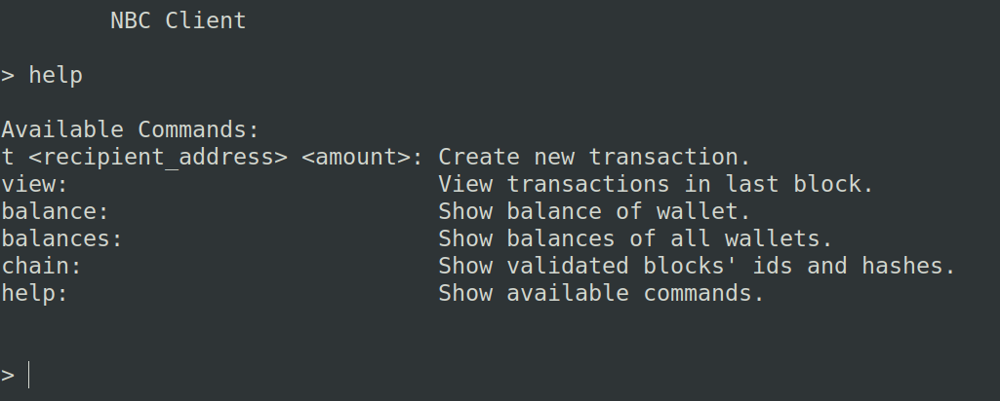

# Noob Cash Coin

This is a repository for the 2021-2022 NTUA project of the lesson 'Distributed Systems' implemented using Flask.

The purpose of this project was to create a simple blockchain consisting of N nodes and benchmark Block Time and Throughput for:
- nodes: 5/10
- mining difficulty: 4/5
- block capacity: 1/5/10

Nodes are miners as well as clients, therefore each node has a process running (client) with the following commands available:

The bootstrap node creates the genesis block that contains a transaction of N*100 NBC (coins) to itself and as soon as the rest of the N-1 nodes are online it creates transactions so that each node eventually has 100 NBC.

The system works using UTXOs and in the case of a branch in the blockchain (as a result of simultaneous mine) it resolves conflicts by adopting the longest chain.

Further specifications about this project exist in the report included ('assignment.pdf', in Greek). Repository also contains the final report ('project_distr_report _final.pdf', also in Greek).

To run this project locally, other than installing the necessary packages, there are a few changes to be made, since the code has been configured to run on the VMs provided by the university:
- config.py: 
    - line 5: bootstrap_ip = '127.0.0.1'
- rest.py:
    - line 63: ipv4 = config.bootstrap_ip
- node.py (not necessary, but advised):
    - line 345: time.sleep(1)